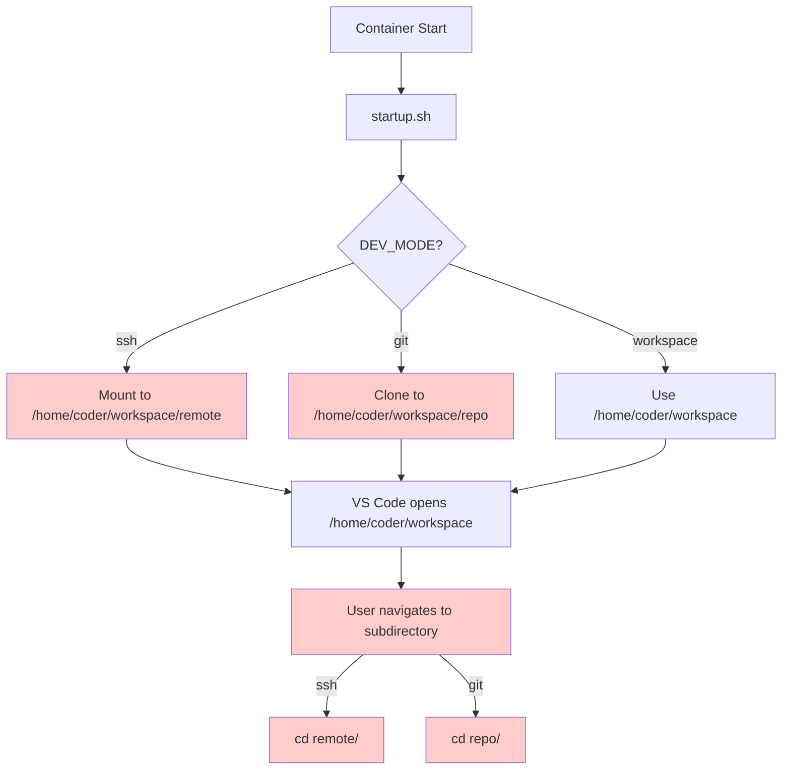
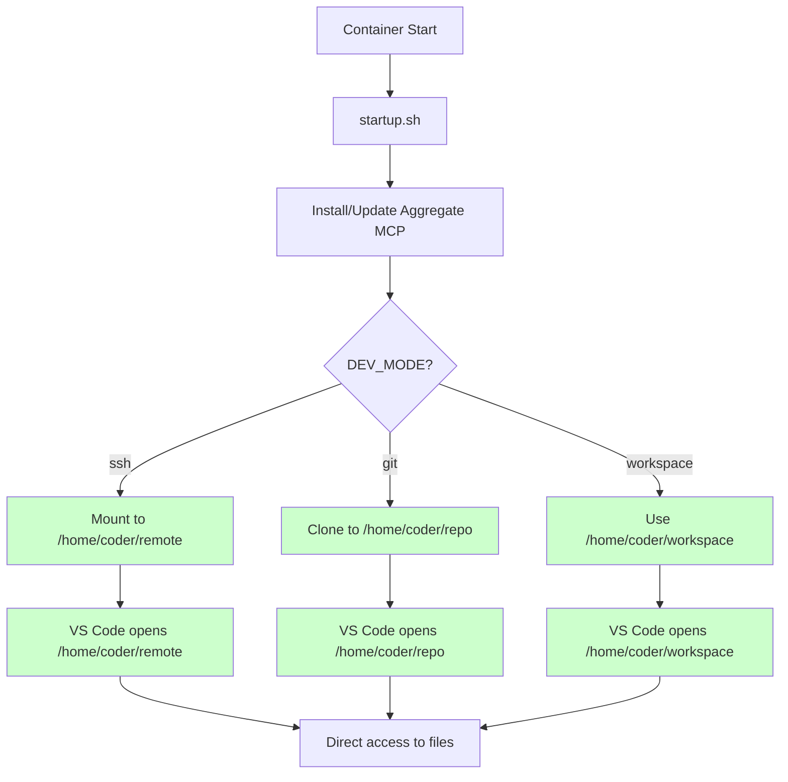
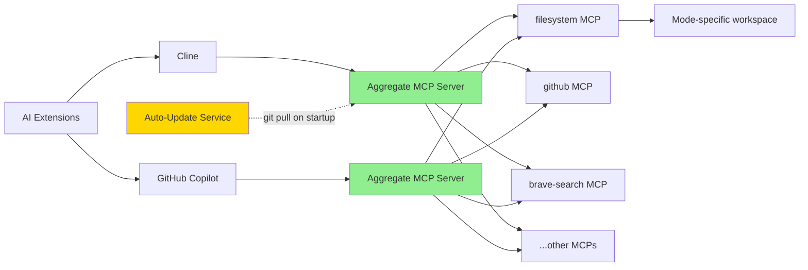
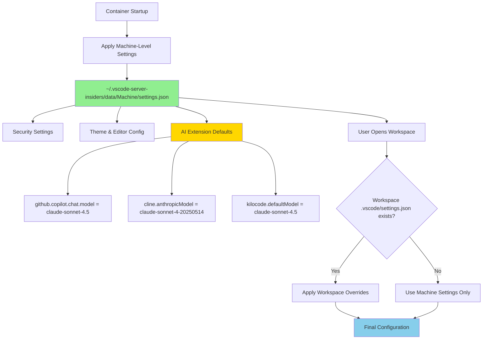
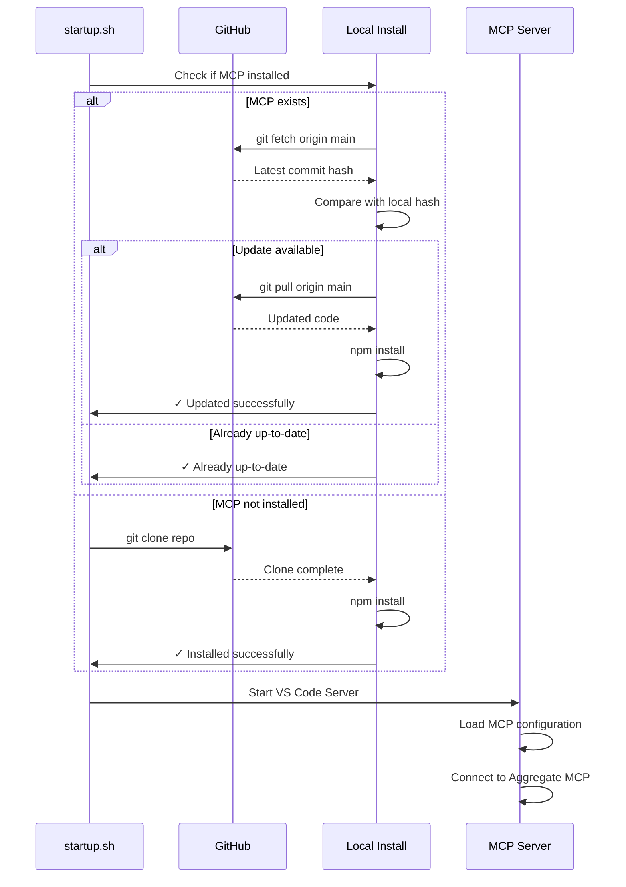
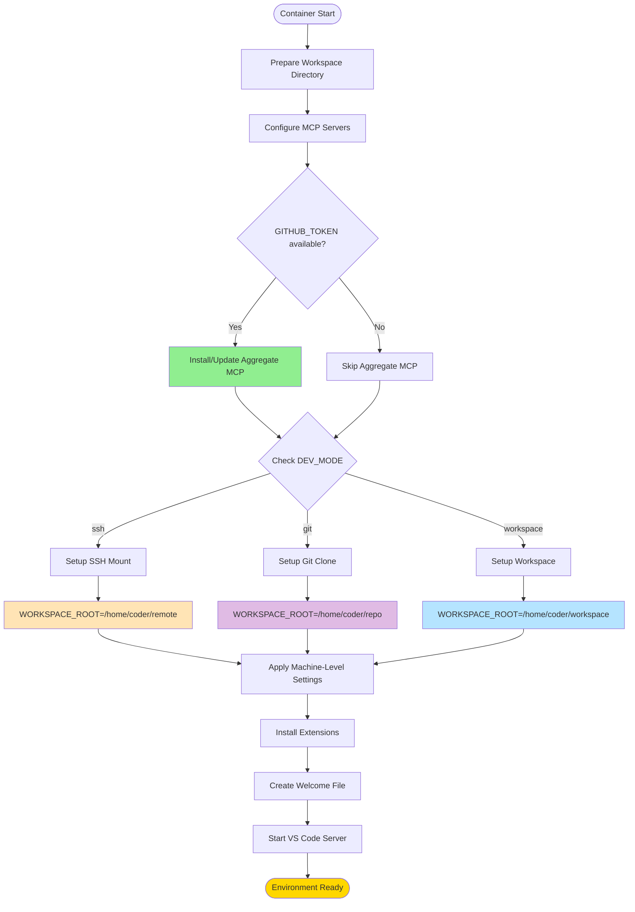

# Dev Farm Architecture Diagrams

## Current vs New Architecture

### Current Architecture (Before Changes)



### New Architecture (After Changes)



## MCP Server Architecture

### Current MCP Setup

```mermaid
graph LR
    A[AI Extensions] --> B[Cline]
    A --> C[GitHub Copilot]
    
    B --> D[filesystem MCP]
    B --> E[github MCP]
    B --> F[brave-search MCP]
    
    C --> G[filesystem MCP]
    C --> H[github MCP]
    C --> I[brave-search MCP]
    
    D --> J[/workspace]
    G --> J
    
    style D fill:#lightblue
    style E fill:#lightblue
    style F fill:#lightblue
    style G fill:#lightblue
    style H fill:#lightblue
    style I fill:#lightblue
```

### New MCP Setup with Aggregate Server



## Workspace Root by Mode

```mermaid
graph TD
    A[Dev Farm Environment] --> B{Mode Selection}
    
    B -->|SSH Mode| C[/home/coder/remote]
    B -->|Git Mode| D[/home/coder/repo]
    B -->|Workspace Mode| E[/home/coder/workspace]
    
    C --> F[SSHFS Mount Point]
    C --> G[Remote filesystem visible at root]
    
    D --> H[Git Clone Root]
    D --> I[Repository files at root]
    
    E --> J[Local Workspace]
    E --> K[User files at root]
    
    F --> L[VS Code Workspace Root = /home/coder/remote]
    G --> L
    
    H --> M[VS Code Workspace Root = /home/coder/repo]
    I --> M
    
    J --> N[VS Code Workspace Root = /home/coder/workspace]
    K --> N
    
    style C fill:#FFE4B5
    style D fill:#E0BBE4
    style E fill:#B5E4FF
    style L fill:#FFE4B5
    style M fill:#E0BBE4
    style N fill:#B5E4FF
```

## Settings Configuration Flow



## Aggregate MCP Server Update Flow



## Complete Startup Flow



## Benefits Summary

### Workspace Root Changes
- **Before**: Navigate through `/workspace/remote/` or `/workspace/repo/`
- **After**: Direct access at workspace root
- **Benefit**: Cleaner, more intuitive file navigation

### Aggregate MCP Server
- **Before**: Each AI tool manages separate MCP servers
- **After**: Single aggregate server proxies to all MCPs
- **Benefit**: Centralized management, auto-updates, easier configuration

### Settings Management
- **Before**: Workspace-level settings required for each workspace
- **After**: Machine-level settings with optional workspace overrides
- **Benefit**: Consistent configuration across all workspaces